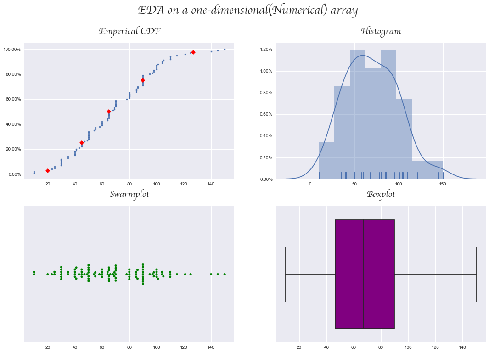
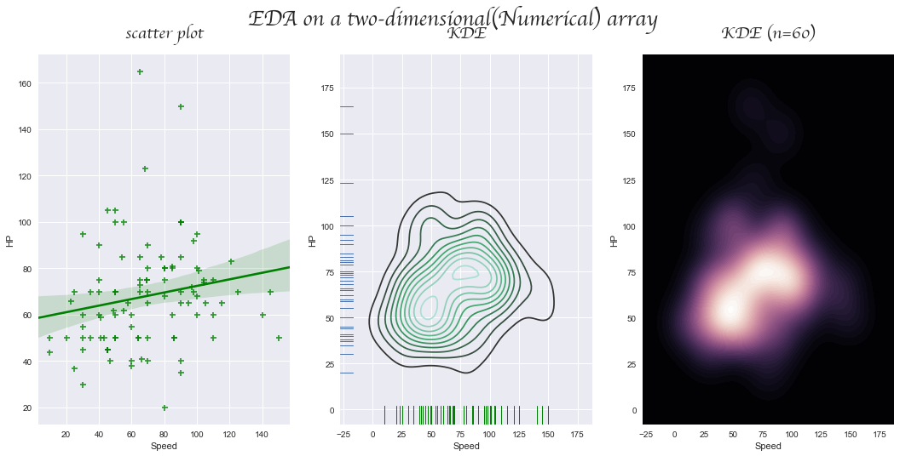

# edaplotting

In the words of John Turkey :
> Exploratory data analysis can never be the whole story, but nothing else can serve as the foundation stone.

### Dependencies

pandas (required) : https://pandas.pydata.org  
numpy (required): http://numpy.scipy.org  
matplotlib (required): http://matplotlib.sourceforge.net  
seaborn (required): https://seaborn.pydata.org  

### Key features

* Mulitple plots with a single plot command with no requirment to import any plotting libraries
* Supports univariate and bivariate exploratory analysis
* Takes only a 100 random data points for plotting
* Includes the ECDF plot : https://en.wikipedia.org/wiki/Empirical_distribution_function on univariate
* Red diamonds on the ECDF plot indicate the following percentiles : 2.5,25,50(median),75,97.5

## looks cool!! But how do i use this library? :confused:

### Installation

```
pip install edaplotting
```

### Usage for univariate EDA

```python
import edaplotting as eda # import the edaplotting library and assign the alias eda
import pandas as pd # import pandas
data = pd.read_csv('Pokemon.csv') # read in a dataset of interest 
myobject = eda.explore(dataframe['Speed'],dataframe['Attack']) # initialize the class with a one-dimensional array
# x and y are passed as kwargs, for univariate only x is considered
myobject.plot_univariate() # plot the object
```



### Usage for bivariate EDA

```python
import edaplotting as eda # import the edaplotting library and assign the alias eda
import pandas as pd # import pandas
data = pd.read_csv('Pokemon.csv') # read in a dataset of interest 
myobject = eda.explore(dataframe['Speed'],dataframe['Attack']) # initialize the class with a two-dimensional array
# x and y are passed as kwargs, for bivariate both x and y are considered
myobject.plot_bivariate() # plot the object
```



### Todo

* Expand for categorical variables

### License

MIT
